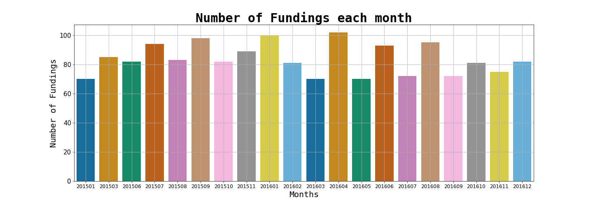

# Indian-Startup-Funding-EDA
> Performing EDA on the Indian Startup Funding Dataset

## Overview:
In this project, we are going to perform exploratory data analysis on the Indian startup funding dataset. Also we will infer some insights and try to answer certain questions about the Indian startup ecosystem.

> Read more about it in my [Blogpost](https://medium.com/@adityamankar09/do-startups-in-bangalore-get-funded-more-19cbf1ed56b6)

## Dataset:
| Column Id |    Column Names   | Data type | Count | Null values |             Description             |
|:---------:|:-----------------:|:---------:|:-----:|:-----------:|:-----------------------------------:|
|     0     |       Sr No       |   int64   |  3044 |    0.0 %    |              Unique ID              |
|     1     |  Date dd/mm/yyyy  |   object  |  3044 |    0.0 %    |     Date when startup was funded    |
|     2     |    Startup Name   |   object  |  3044 |    0.0 %    |           Name of startup           |
|     3     | Industry Vertical |   object  |  2873 |    5.62 %   |     Specifies its industry type     |
|     4     |    SubVertical    |   object  |  2108 |   30.75 %   | Specifies its niche in the industry |
|     5     |   City Location   |   object  |  2864 |    5.91 %   |   Location where startup is based   |
|     6     |   Investors Name  |   object  |  3020 |    0.79 %   |         Name of the investor        |
|     7     |  Investment Type  |   object  |  3040 |    0.13 %   |          Type of investment         |
|     8     |   Amount in USD   |   object  |  2084 |   31.54 %   |        Funding amount in USD        |
|     9     |      Remarks      |   object  |  419  |   86.24 %   |         Special Description         |

----

## Motivation:
- India is one of the fastest-growing economies in the world. In the past decade we have seen a large number of unicorn startups rise in the Indian startup ecosystem which has a global impact. 
- Startups may be small companies but they can play a significant role in economic growth. They create more jobs which mean more employment, and more employment means an improved economy. 
- By using data analysis techniques we can analyze the data and answer various questions related to the Indian startup ecosystem.

## Conclusion:
- Technology-based startups which provide their services to the everyday consumer are very probable to get a lot of funding. We have seen such startups like Flipkart and Paytm.
- A large number of Startups based in metropolitan cities like Bangalore and Mumbai are funded, which may be due to the fact that talent availability is massive in those cities.
- Most of the fundings are either of Private Equity and Seed Funding type.
- Ratan Tata, Indian Angel Network, and Kalaari Capital are some of the top investors in the Indian startup ecosystem.
- Flipkart, Paytm and Rapido Bike taxi are one of the most funded startups whereas Ola Cabs and Swiggy were funded the most number of times.
